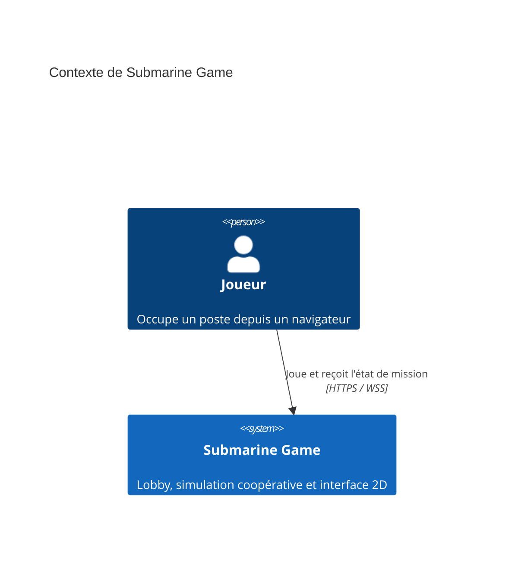
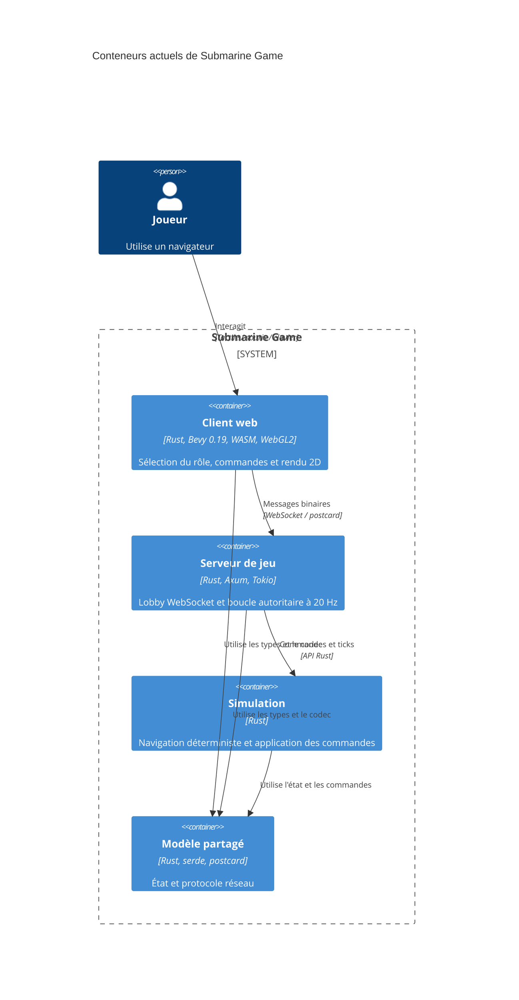
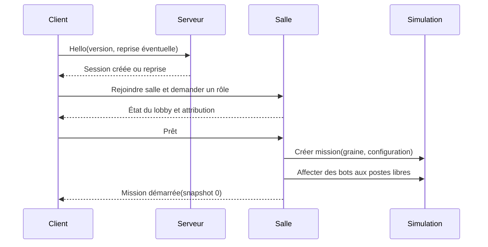
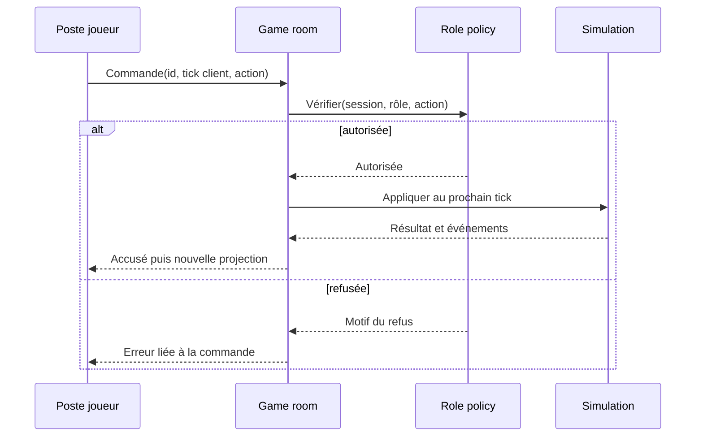
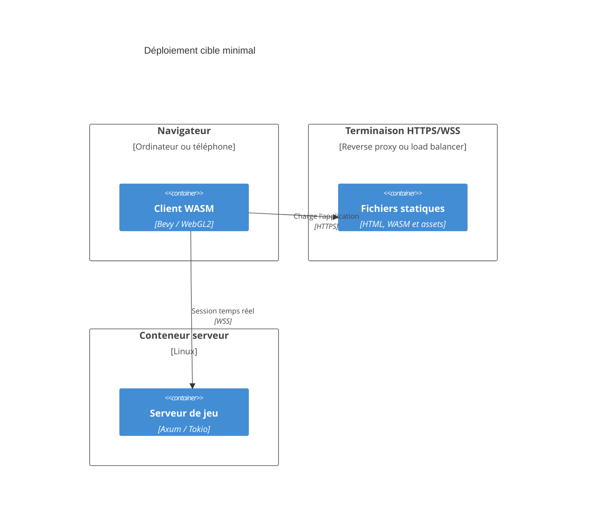

# Architecture de Submarine Game

**Version :** 0.1  
**Date :** 27 août 2026  
**Statut :** architecture actuelle documentée, architecture cible proposée

Ce document suit une structure arc42 allégée. Les éléments marqués **existant** décrivent le dépôt actuel. Les éléments marqués **cible** décrivent l'architecture nécessaire au jeu défini dans le [Game Design Document](game-design.md).

## 1. Introduction et objectifs

### 1.1 Objectif du système

Le système fournit une simulation tactique de sous-marin coopérative en temps réel. Des clients web spécialisés par poste envoient des commandes à un serveur autoritaire. Le serveur valide les responsabilités de chaque rôle, fait avancer une simulation déterministe et diffuse l'état observable aux joueurs.

### 1.2 Fonctionnalités principales

- Salle de jeu de un à cinq participants.
- Un poste distinct par joueur et bots pour les postes vacants.
- Simulation de navigation, détection, combat, ressources et avaries.
- Interface 2D compatible ordinateur et téléphone.
- Reconnexion à une partie en cours.
- Mission reproductible à partir d'une graine et d'une séquence de commandes.

### 1.3 Objectifs qualité

| Priorité | Objectif | Critère cible |
|---:|---|---|
| 1 | Jouabilité web et mobile | cinq postes utilisables au tactile à partir de 360 px de large |
| 2 | Cohérence de la partie | aucune règle décisive calculée uniquement par un client |
| 3 | Déterminisme | même graine et mêmes commandes produisent le même résultat |
| 4 | Résilience réseau | une déconnexion temporaire est remplacée par un bot puis reconnectable |
| 5 | Maintenabilité | règles testables sans Bevy, Axum, Tokio ni navigateur |
| 6 | Performance | simulation stable à 20 Hz pour une salle sur la cible serveur retenue |

### 1.4 Parties prenantes

| Partie prenante | Attentes |
|---|---|
| Joueur | interface lisible, commandes réactives, résultat explicable |
| Groupe de joueurs | lobby simple, rôles uniques, continuité malgré une déconnexion |
| Conception | paramètres d'équilibrage centralisés et scénarios reproductibles |
| Développement | frontières de crates claires et tests rapides |
| Exploitation | déploiement simple, métriques par salle et diagnostic des erreurs |

## 2. Contraintes

### 2.1 Contraintes techniques

| ID | Contrainte | Conséquence |
|---|---|---|
| CT-01 | Client Rust compilé en WebAssembly | APIs navigateur et ressources non `Send` à respecter |
| CT-02 | Rendu Bevy 0.19 compatible WebGL2 | éviter les fonctions uniquement WebGPU et les calculs GPU avancés |
| CT-03 | Client utilisable sur téléphone | budget visuel réduit, contrôles sans survol et UI responsive |
| CT-04 | WebSocket binaire `postcard` | protocole partagé compact mais à versionner explicitement |
| CT-05 | Serveur autoritaire | les clients soumettent des intentions, jamais un nouvel état |
| CT-06 | Simulation à 20 Hz | commandes séquentielles et règles indépendantes du framerate de rendu |
| CT-07 | `simulation` dépend uniquement de `shared` | aucune dépendance à Bevy, Axum, Tokio ou à l'état serveur |
| CT-08 | État horizontal et profondeur séparés | ne pas remplacer `x`, `y`, `depth` par un vecteur 3D générique |

### 2.2 Conventions

- Les messages réseau sont enveloppés dans `ClientMessage` et `ServerMessage`.
- Les grandeurs du domaine utilisent des unités documentées : mètres, secondes, degrés nautiques et nœuds.
- Les flottants non finis sont rejetés à la frontière de la simulation.
- Les valeurs d'équilibrage sont regroupées dans une configuration de mission ou de bâtiment.
- Les changements de protocole incompatibles augmentent sa version.
- Le français est la langue initiale de l'interface ; les identifiants de code restent en anglais.

## 3. Périmètre et contexte

### 3.1 Contexte métier

Le premier périmètre ne dépend d'aucun service externe métier. L'identité persistante, le matchmaking public, la télémétrie externe et le chat vocal ne sont pas requis.

### 3.2 Contexte technique

| Interface | Technologie actuelle | Responsabilité |
|---|---|---|
| Page du jeu | HTML + WASM + WebGL2 | charger le client Bevy |
| Session temps réel | WebSocket binaire | rejoindre le lobby, envoyer les commandes et recevoir les événements |
| Sérialisation | `serde` + `postcard` | encoder les enveloppes partagées |
| Serveur HTTP | Axum | exposer `/ws` et accepter l'upgrade WebSocket |
| Boucle de jeu | Tokio + canal `mpsc` | ordonner les commandes et avancer la simulation |

En production, le navigateur doit construire dynamiquement une URL `wss://` à partir de l'origine de la page ou d'une configuration explicite. L'adresse locale codée en dur actuelle est réservée au développement et doit disparaître avant un test sur téléphone réel.

## 4. Stratégie de solution

### 4.1 Principes

1. Conserver le workspace en quatre crates tant qu'une nouvelle frontière n'est pas justifiée.
2. Faire de `simulation` la source unique des règles, de l'IA déterministe et des transitions d'état de mission.
3. Faire de `server` le propriétaire des connexions, salles, présences, permissions et cadences.
4. Limiter `shared` aux types de protocole et aux données légères partagées.
5. Faire de `client` une projection interactive de l'état observable, sans logique décisive.
6. Livrer par vertical slices, avec une mission jouable à chaque jalon majeur.

### 4.2 Architecture actuelle et cible

| Domaine | Existant | Cible |
|---|---|---|
| Lobby | un lobby global, démarrage à cinq rôles | plusieurs salles, démarrage dès un joueur, prêts et bots |
| Présence | retrait à la déconnexion | période de grâce, bot de remplacement et reprise de rôle |
| Navigation | consignes appliquées instantanément | consignes, valeurs réelles, inertie, plongée et ballasts |
| Sonar | commande sans effet | observations, pistes incertaines et signature acoustique |
| Armement | événement de tir immédiat | tubes, solution de tir et entités torpilles |
| Ingénierie | état minimal et réparation sans mutation | énergie, batterie, air, compartiments, avaries et réparations temporisées |
| IA | absente | bots de poste et navires ennemis déterministes |
| Client | sélection de rôle, HUD et poste pilote | cinq interfaces responsive et état de reconnexion |
| Protocole | enveloppes minimales non versionnées | version, salle, séquences, reprise et erreurs structurées |

## 5. Vue des blocs de construction

### 5.1 Conteneurs existants

Ce diagramme décrit uniquement les éléments réellement présents dans le dépôt.

### 5.2 Crate `shared`

**Existant :**

- `CrewRole`, `SystemId`, `SystemStatus` et `SubmarineState` ;
- `PlayerCommand`, `GameEvent`, erreurs et enveloppes ;
- codec `postcard`.

**Cible :**

- identifiants opaques de salle, joueur, entité, piste et commande ;
- `ProtocolVersion` et informations de compatibilité ;
- commandes de lobby séparées des commandes de mission ;
- vues observables par rôle, sans exposer l'état secret de l'ennemi ;
- numéro de snapshot et tick serveur ;
- types d'erreur stables et affichables.

`shared` ne doit pas contenir de logique d'IA, de minuterie, de socket ni d'élément Bevy.

### 5.3 Crate `simulation`

**Existant :** `Simulation::new`, déplacement nautique simple, normalisation des consignes et quelques événements symboliques.

**Composants cibles :**

| Composant | Responsabilité |
|---|---|
| Mission | phase, objectifs, temps, victoire et défaite |
| World | entités navales, torpilles et environnement tactique |
| Submarine | mouvement, ressources, compartiments et systèmes |
| Detection | signatures, observations, pistes et perte de contact |
| Weapons | tubes, solution de tir, trajectoires et impacts |
| Damage control | dégâts, propagation, pompage et réparations |
| Crew automation | bots de poste exécutant des ordres autorisés |
| Enemy AI | perception et états escorte, suspicion, recherche et attaque |
| Mission RNG | hasard déterministe dérivé de la graine de mission |

Les systèmes sont exécutés dans un ordre stable à chaque tick. Toute dépendance à l'heure murale ou à un générateur aléatoire global est interdite.

### 5.4 Crate `server`

**Existant :** route WebSocket, lobby global, attribution des rôles, validation des commandes et tâche de simulation à 20 Hz.

**Composants cibles :**

| Composant | Responsabilité |
|---|---|
| Room registry | créer, retrouver et détruire les salles |
| Session | authentifier une connexion éphémère et gérer sa reprise |
| Lobby | rôles, états prêts, paramètres et lancement |
| Game room | posséder une simulation et ordonner les commandes |
| Role policy | vérifier qu'une commande est permise pour le rôle actif |
| Projection | produire la vue observable de chaque rôle |
| Broadcaster | diffuser snapshots et événements avec backpressure contrôlée |

Une salle possède une seule file séquentielle de commandes. Un client lent ne doit pas bloquer le tick : les snapshots anciens peuvent être remplacés par le plus récent, tandis que les événements critiques doivent être conservés ou provoquer une resynchronisation.

### 5.5 Crate `client`

**Existant :** connexion `ewebsock` en ressource `NonSend`, sélecteur de rôle, état réseau, interpolation et interface du pilote.

**Composants cibles :**

| Composant | Responsabilité |
|---|---|
| Connection | URL configurable, protocole, reprise et état de connexion |
| Session state | salle, joueur, rôle, tick reçu et droits disponibles |
| Command state | commande locale en attente, acceptée, exécutée ou rejetée |
| Station shell | navigation commune, alertes et adaptation responsive |
| Station views | capitaine, pilotage, sonar, ingénierie et armement |
| Tactical rendering | carte, pistes, incertitudes et entités observables |
| Accessibility | taille tactile, contraste, texte et réduction des animations |

Le client peut prédire un retour d'interface, mais ne prédit pas les contacts, impacts, dégâts ou ressources autoritaires.

## 6. Vue d'exécution

### 6.1 Connexion et démarrage cible

### 6.2 Traitement d'une commande

### 6.3 Déconnexion et bot de remplacement

1. Le serveur marque la session comme déconnectée sans libérer immédiatement son rôle.
2. Le rôle passe sous contrôle d'un bot à partir d'un tick défini.
3. Le bot conserve les ordres actifs compatibles.
4. Le client revient avec son jeton de reprise et son dernier numéro de snapshot.
5. Le serveur renvoie un snapshot complet puis rend le rôle au joueur sur une frontière de tick.
6. À expiration de la période de grâce, la place peut être libérée selon les règles de la salle.

### 6.4 Production d'une piste sonar

1. `Detection` calcule les signatures réellement audibles par le sous-marin.
2. Le poste sonar reçoit des observations, pas les entités ennemies.
3. Le joueur ou le bot associe une observation à une piste.
4. La simulation met à jour confiance et incertitude.
5. Une piste partagée entre dans les projections du capitaine et de l'armement.
6. La perte d'observation fait dériver puis expirer la piste.

## 7. Déploiement

### 7.1 Développement actuel

- serveur Axum sur `0.0.0.0:3000` ;
- client Trunk sur `127.0.0.1:8080` ;
- WebSocket local `ws://127.0.0.1:3000/ws` ;
- aucun stockage persistant requis.

### 7.2 Cible de production

La première cible peut rester un processus serveur unique. Une salle n'est pas distribuée entre plusieurs processus. Avant une mise à l'échelle horizontale, le routage doit garantir qu'une connexion revient vers le processus propriétaire de sa salle.

## 8. Concepts transverses

### 8.1 Autorité et information cachée

L'état interne complet reste dans `simulation`. Le serveur construit une projection par rôle. Un client sonar ne reçoit pas la position réelle d'un ennemi caché ; il reçoit uniquement les observations et pistes auxquelles son rôle a droit. Cette règle empêche la triche triviale et préserve la mécanique d'information incomplète.

### 8.2 Déterminisme

- pas de lecture directe de l'horloge dans les règles ;
- `dt` fixe contrôlé par la boucle ;
- ordre d'itération stable des entités ;
- générateur pseudo-aléatoire possédé par la mission ;
- commandes indexées par tick et ordonnées de façon stable ;
- tests de rejeu à partir d'une graine et d'un journal de commandes.

Le déterminisme bit à bit entre architectures n'est pas supposé tant que les calculs reposent sur `f32`. Le premier objectif est la reproductibilité sur la même cible. Si un rejeu portable devient nécessaire, les règles sensibles devront utiliser des nombres fixes ou une quantification explicite.

### 8.3 Protocole et compatibilité

Le protocole cible commence par une négociation de version. Les messages de partie incluent un identifiant de salle et un numéro de séquence ou de tick. Une modification incompatible de l'ordre ou de la forme des variantes `postcard` nécessite une nouvelle version ; ajouter une variante au milieu d'un enum existant est interdit sans migration contrôlée.

### 8.4 Backpressure

- Les commandes entrantes ont une capacité bornée et un refus explicite en cas de surcharge.
- Un nouveau snapshot peut remplacer un snapshot non envoyé plus ancien.
- Les événements critiques sont numérotés et confirmés par le prochain snapshot complet.
- Un client durablement lent est déconnecté avec une cause exploitable.

### 8.5 Sécurité

- HTTPS et WSS obligatoires en production.
- Jetons de salle non prédictibles et limités à une session.
- Validation de taille avant décodage d'une trame.
- Limitation du débit de connexion et de commandes.
- Validation du rôle et des paramètres pour chaque commande.
- Aucun secret ni état ennemi complet envoyé au client.

### 8.6 Observabilité

Les journaux structurés incluent au minimum `room_id`, `session_id`, `tick`, type de commande et motif de rejet. Les métriques couvrent nombre de salles, joueurs connectés, durée des ticks, taille des files, trames rejetées et reconnexions.

### 8.7 Tests

| Niveau | Cible |
|---|---|
| Unitaire | formules, transitions et permissions de chaque système |
| Propriété | bornes physiques, absence de valeurs non finies et invariants de ressources |
| Rejeu | même graine et même journal donnent le même état final |
| Intégration | lobby, démarrage avec bots, déconnexion et reprise |
| Protocole | aller-retour codec et compatibilité des fixtures versionnées |
| Client WASM | compilation WebGL2 et logique d'interface testable sans rendu complet |
| E2E | une mission courte jouée par clients automatisés contre un serveur réel |

## 9. Décisions d'architecture

| ID | Décision | Statut |
|---|---|---|
| AD-001 | serveur autoritaire et commandes comme intentions | acceptée, existante |
| AD-002 | simulation indépendante de Bevy, Axum et Tokio | acceptée, existante |
| AD-003 | client web Rust/Bevy avec cible WebGL2 | acceptée, existante |
| AD-004 | profondeur séparée des coordonnées horizontales | acceptée, existante |
| AD-005 | conserver cinq rôles et automatiser les postes vacants | proposée |
| AD-006 | IA et hasard de mission déterministes dans `simulation` | proposée |
| AD-007 | projections d'état différentes selon les rôles | proposée |
| AD-008 | protocole versionné avec reprise par snapshot complet | proposée |
| AD-009 | un processus propriétaire par salle | proposée |

Les décisions proposées doivent être transformées en ADR séparés lorsqu'un choix concurrent sérieux apparaît ou avant leur première implémentation structurante.

## 10. Exigences qualité

| ID | Scénario | Cible |
|---|---|---|
| Q-01 | un joueur touche une commande | retour local immédiat et résultat serveur visible sans ambiguïté |
| Q-02 | le réseau est interrompu pendant 20 secondes | le bot reprend le rôle et le joueur retrouve la partie |
| Q-03 | cinq joueurs envoient des commandes simultanées | ordre stable, aucune mutation concurrente de la simulation |
| Q-04 | le client reçoit un snapshot ancien | il l'ignore sans revenir dans le temps |
| Q-05 | un téléphone passe du portrait au paysage | interface reconstruite sans perdre session ni état de commande |
| Q-06 | un développeur ajoute un type de navire | pas de dépendance nouvelle dans `shared` ou `client` vers le serveur |
| Q-07 | un joueur inspecte les messages réseau | aucune position exacte d'un contact non observé n'est présente |
| Q-08 | la durée d'un tick augmente | métrique et journal identifient la salle concernée |

## 11. Risques et dette technique

| ID | Risque ou dette | Impact | Traitement |
|---|---|---|---|
| R-01 | portée de simulation trop large avant une mission jouable | élevé | vertical slices et règles minimales par système |
| R-02 | interface dense sur petit téléphone | élevé | prototypes tactiles avant chaque mécanique profonde |
| R-03 | calculs `f32` non reproductibles entre cibles | moyen | quantification ou nombres fixes si les rejeux inter-cibles l'exigent |
| R-04 | surcharge réseau par snapshots complets | moyen | mesurer d'abord, puis projections compactes et snapshots remplaçables |
| R-05 | IA ennemie utilisant accidentellement l'état omniscient | élevé | API de perception dédiée et tests de visibilité |
| TD-01 | URL WebSocket locale codée en dur | bloque mobile/déploiement | configuration par origine avant tests distants |
| TD-02 | lobby global et démarrage à cinq joueurs | bloque le mode retenu | introduire salles, prêts et bots en premier jalon |
| TD-03 | protocole non versionné | migration risquée | version et fixtures avant extension importante |
| TD-04 | commandes sonar, réparation et tir principalement symboliques | jeu non fonctionnel | remplacer par vertical slices de domaine |
| TD-05 | PWA annoncée mais non configurée | attente incorrecte | ajouter manifeste/service worker ou corriger la promesse |

## 12. Glossaire

| Terme | Définition |
|---|---|
| Commande | intention envoyée par un joueur ou un bot à la simulation |
| Événement | fait produit par une transition de simulation |
| Observation | mesure ponctuelle et imparfaite d'une signature |
| Piste | estimation persistante construite à partir d'observations |
| Projection | sous-ensemble de l'état autorisé et utile pour un rôle |
| Snapshot | représentation complète d'une projection à un tick donné |
| Tick | pas fixe d'avancement de la simulation |
| Vertical slice | incrément traversant règles, serveur, protocole et interface pour être jouable |
| Reprise | reconnexion d'une session à sa salle et son rôle précédents |
| Signature | information physique susceptible d'être détectée, notamment le bruit |
