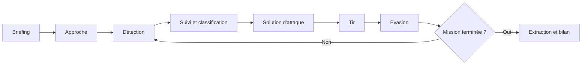
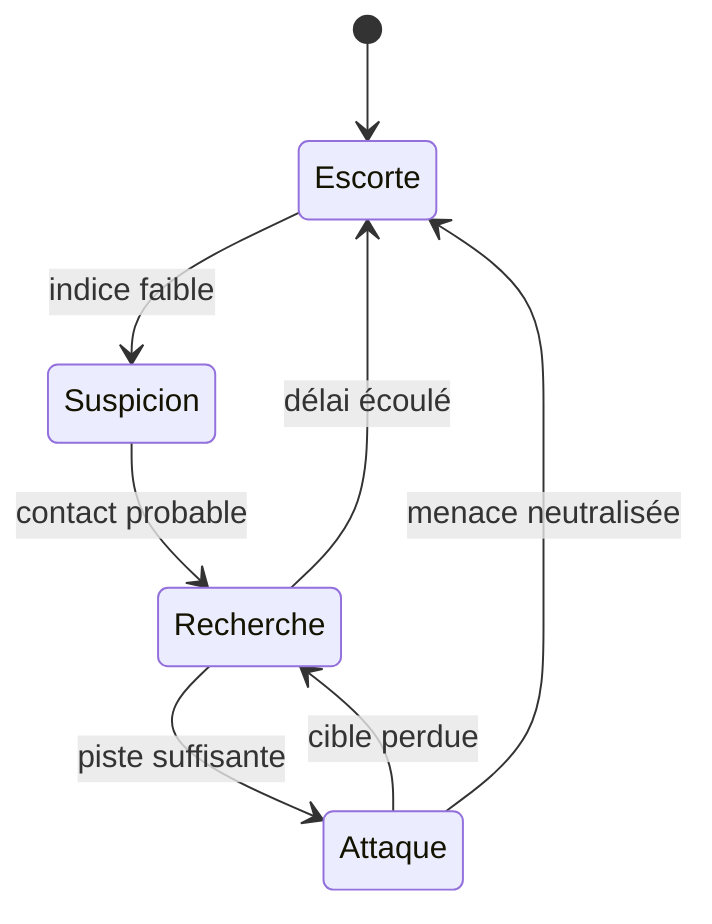

# Game Design Document - Submarine Game

**Version :** 0.1  
**Date :** 28 août 2026  
**Statut :** brouillon de conception  
**Référence d'inspiration :** *Wolfpack* (Usurpator AB), pour sa coopération par postes et ses systèmes interdépendants. Le présent jeu reste une création 2D originale dans un univers fictif.

## 1. Vision

*Submarine Game* est un jeu de simulation tactique coopératif en 2D pour navigateur. Un équipage de un à cinq joueurs commande un sous-marin fictif inspiré des bâtiments diesel-électriques de la Seconde Guerre mondiale. Chaque joueur reçoit des informations et des commandes propres à son poste. La réussite dépend de la communication, de la préparation des manœuvres et de la maîtrise du bruit émis par le bâtiment.

Le jeu doit fonctionner sur ordinateur comme sur téléphone, sans reproduire un intérieur en 3D ni demander de manipuler de nombreux petits contrôles. La complexité vient des décisions et des interactions entre systèmes. Chaque procédure est représentée par un petit nombre d'actions lisibles et tactiles.

### 1.1 Promesse au joueur

> Repérer un convoi sans être détecté, coordonner cinq postes sous pression, préparer une attaque crédible puis survivre à la riposte.

### 1.2 Public cible

- Joueurs appréciant la coopération, la tactique navale et les simulations accessibles.
- Groupes de un à cinq joueurs disposant d'un navigateur moderne.
- Sessions visées de 30 à 45 minutes pour une mission standard.
- Prise en main progressive, sans connaissance navale préalable.

### 1.3 Piliers de conception

1. **Coopération asymétrique :** chaque poste possède une partie de l'information et de la solution.
2. **Tension acoustique :** vitesse, machines, avaries et actions influencent la probabilité de détection.
3. **Procédures significatives :** les opérations importantes nécessitent plusieurs postes ou une préparation dans le temps.
4. **Lisibilité 2D :** les instruments servent la décision et restent utilisables au tactile.
5. **Équipage flexible :** les postes inoccupés sont confiés à des bots commandables.
6. **Serveur autoritaire :** les mêmes règles s'appliquent à tous les joueurs et ne dépendent pas du rendu client.

## 2. Périmètre

### 2.1 Inclus dans la première version complète

- Missions coopératives contre des convois et leurs escortes contrôlés par le serveur.
- Navigation sur un plan horizontal avec profondeur séparée.
- Propulsion de surface et propulsion électrique en plongée.
- Batterie, oxygène, bruit et intégrité de coque.
- Sonar passif et actif, contacts incertains et classification progressive.
- Préparation des tubes, solution de tir, torpilles et impacts.
- Avaries, voies d'eau, incendies, réparations et distribution d'énergie.
- Un à cinq joueurs, bots pour les postes vacants et reconnexion.
- Interface responsive utilisable à la souris, au clavier et au tactile.

### 2.2 Hors périmètre initial

- Intérieur 3D ou déplacement d'un avatar dans le sous-marin.
- Reproduction exacte d'un bâtiment, d'une bataille ou d'une marine historique.
- Joueur contre joueur.
- Campagne persistante et progression à long terme.
- Monde ouvert, météo complexe ou construction de sous-marins.
- Simulation individuelle de chaque membre d'équipage non joueur.

## 3. Boucle de jeu

### 3.1 Briefing

L'équipage reçoit une zone d'opération, un objectif principal, d'éventuels objectifs secondaires et une limite de temps. Les informations de départ sont volontairement incomplètes : route probable du convoi, composition estimée et conditions générales.

### 3.2 Approche

Le capitaine choisit une route. Le pilotage arbitre entre vitesse et discrétion. L'ingénierie prépare les ressources nécessaires à la plongée. Les postes vacants peuvent recevoir des ordres anticipés.

### 3.3 Détection et suivi

Le sonar cherche des signatures acoustiques. Un signal devient un contact, puis une piste suivie. Sa position estimée comporte une incertitude qui diminue avec le temps et la qualité des observations.

### 3.4 Attaque

L'équipage identifie une cible, détermine sa route, prépare les tubes et positionne le sous-marin. Un tir précipité utilise une solution imprécise. Un tir préparé augmente les chances d'impact mais laisse plus de temps aux escortes pour détecter le sous-marin.

### 3.5 Évasion

Après une détection ou un impact, les escortes recherchent puis attaquent le sous-marin. L'équipage doit réduire son bruit, changer de profondeur, manœuvrer et réparer les avaries sans dépasser ses limites structurelles.

### 3.6 Fin de mission

Une mission se termine lorsque le sous-marin atteint sa zone d'extraction, lorsque les objectifs sont accomplis et la menace quittée, lorsque le temps expire ou lorsque le sous-marin est perdu.

## 4. Équipage

Les cinq rôles existants sont conservés. Cette répartition réduit les changements structurels tout en donnant à chaque poste une identité forte.

### 4.1 Capitaine

**Responsabilité :** construire la situation tactique et coordonner l'équipage.

**Informations principales :**

- carte tactique et objectifs ;
- pistes partagées par le sonar ;
- état synthétique du sous-marin ;
- ordres actifs et disponibilité des postes ;
- chronologie des événements importants.

**Commandes principales :**

- désigner une piste prioritaire et une cible ;
- tracer une route et poser des repères ;
- définir le niveau de discrétion ;
- donner des ordres aux bots ;
- autoriser le tir et déclencher les procédures d'urgence.

Le capitaine ne contrôle pas directement les instruments des joueurs présents. En solo, il peut ouvrir n'importe quel poste et commander tous les bots.

### 4.2 Pilotage

**Responsabilité :** exécuter la route, maîtriser la profondeur et conserver la stabilité du bâtiment.

**Informations principales :** cap réel et demandé, vitesse, profondeur, taux de plongée, assiette, état des ballasts et limites communiquées par l'ingénierie.

**Commandes principales :**

- barre et cap demandé ;
- régime machine ;
- profondeur demandée et plans de plongée ;
- remplissage ou chasse des ballasts ;
- arrêt d'urgence et remontée d'urgence.

Le cap, la vitesse et la profondeur suivent des consignes distinctes des mesures réelles. Le sous-marin possède une accélération, un taux de virage et une vitesse verticale limités.

### 4.3 Sonar

**Responsabilité :** détecter, suivre et classifier les contacts.

**Informations principales :** spectre simplifié, relèvements, qualité des pistes, bruit propre et historique des observations.

**Commandes principales :**

- orienter l'écoute et sélectionner une bande ;
- créer, fusionner ou abandonner une piste ;
- estimer le type et la vitesse d'un contact ;
- partager une piste avec le capitaine et l'armement ;
- émettre un ping actif.

Le sonar ne reçoit jamais immédiatement le type exact, la position exacte et l'intention d'un contact.

### 4.4 Ingénierie

**Responsabilité :** fournir l'énergie, gérer l'endurance et maintenir le bâtiment opérationnel.

**Informations principales :** moteurs, batterie, oxygène, consommation, température, pompes, compartiments, voies d'eau et état des systèmes.

**Commandes principales :**

- démarrer ou arrêter diesels et moteurs électriques ;
- distribuer la puissance entre propulsion, sonar, vie et armement ;
- lancer pompes, ventilation et recharge ;
- isoler un système ou un compartiment ;
- affecter une équipe abstraite à une réparation.

Une réparation demande du temps et peut consommer des pièces. Elle ne réussit pas instantanément.

### 4.5 Armement

**Responsabilité :** préparer les tubes et produire une solution de tir.

**Informations principales :** tubes, torpilles, cible désignée, observations partagées, paramètres de la solution et probabilité qualitative d'interception.

**Commandes principales :**

- choisir et charger une torpille ;
- inonder, ouvrir et refermer un tube ;
- saisir ou reprendre les paramètres d'une cible ;
- régler profondeur, vitesse et mode de la torpille ;
- tirer puis lancer le rechargement.

Le jeu ne fournit pas un pourcentage exact de réussite. Il indique la stabilité de la solution et les sources d'incertitude.

## 5. Joueurs et bots

### 5.1 Composition d'une partie

- Une salle accepte de un à cinq joueurs.
- Un rôle ne peut être occupé que par un joueur à la fois.
- La partie peut commencer dès qu'un joueur est prêt.
- Chaque rôle vacant est occupé par un bot.
- Un joueur déconnecté peut reprendre son rôle pendant une période de grâce ; un bot prend immédiatement le relais.

### 5.2 Ordres aux bots

Les bots ne jouent pas de manière autonome sans intention du capitaine. Ils exécutent des ordres de haut niveau :

- maintenir un cap, une vitesse ou une profondeur ;
- passer en écoute silencieuse ;
- suivre une piste ;
- préparer un tube contre une cible ;
- maintenir une réserve de batterie ;
- réparer une avarie prioritaire.

Un ordre possède un état visible : en attente, en cours, bloqué, terminé ou annulé. Un bot signale la raison d'un blocage au lieu d'échouer silencieusement.

### 5.3 Difficulté des bots

La difficulté agit sur le délai de réaction, la précision des estimations et la capacité à signaler un danger. Elle ne doit pas permettre aux bots d'accéder à des informations cachées aux joueurs.

## 6. Règles de simulation

### 6.1 Référentiel et temps

- La carte utilise des mètres sur les axes horizontaux `x` et `y`.
- Le cap nautique utilise `0°` au nord et `90°` à l'est.
- La profondeur est une grandeur séparée, positive vers le bas.
- Le serveur avance la simulation à fréquence fixe.
- Les durées longues peuvent être accélérées uniquement lorsque la mission ne présente aucun danger immédiat et avec l'accord de tous les joueurs.
- Les événements aléatoires utilisent un générateur déterministe initialisé par la graine de mission.

### 6.2 Mouvement

Le mouvement dépend de la vitesse réelle, pas directement de la consigne. Les valeurs suivantes constituent une première base d'équilibrage pour un sous-marin fictif :

| Paramètre | Valeur initiale |
|---|---:|
| Vitesse maximale en surface | 18 nœuds |
| Vitesse maximale en plongée | 8 nœuds |
| Vitesse silencieuse | 2 nœuds ou moins |
| Profondeur périscopique | 12 m |
| Profondeur opérationnelle | 150 m |
| Profondeur critique | 220 m |
| Profondeur d'écrasement nominale | 250 m |

Les paramètres M2 suivants sont provisoires et centralisés dans `SubmarineConfig`. Ils servent à rendre la boucle d'endurance testable avant les sessions d'équilibrage :

| Paramètre M2 | Valeur provisoire |
|---|---:|
| Accélération / décélération | 0,75 / 1,25 nœud/s |
| Taux de virage maximal | 4°/s |
| Vitesse verticale normale / urgence | 1,5 / 3 m/s |
| Décharge électrique de base | 0,01 point/s |
| Décharge propulsion à plein régime | 0,18 point/s |
| Recharge diesel | 0,25 point/s |
| Consommation / ventilation d'oxygène | 0,015 / 0,5 point/s |
| Seuil batterie basse / air critique | 20 % / 15 % |

Au-delà de la profondeur critique, la coque subit des tests de résistance périodiques. La probabilité de dégâts augmente avec la profondeur, les avaries existantes et le temps passé sous la limite.

### 6.3 Propulsion, batterie et oxygène

- Les diesels fonctionnent lorsque les prises d'air sont disponibles.
- En surface, les diesels peuvent propulser le sous-marin et recharger la batterie.
- En plongée, la propulsion utilise la batterie.
- La consommation électrique augmente de manière non linéaire avec la vitesse.
- Sonar actif, pompes et rechargement des systèmes ajoutent une consommation temporaire.
- L'oxygène diminue tant que le bâtiment ne ventile pas.
- Une mauvaise qualité d'air ralentit les réparations avant de mettre l'équipage en danger.
- Une batterie vide ne détruit pas immédiatement le sous-marin, mais limite propulsion, pompes et instruments.

### 6.4 Signature et bruit

Chaque source produit une contribution à la signature acoustique :

- vitesse des hélices ;
- moteurs et générateurs ;
- pompes et ventilation ;
- chargement d'un tube ;
- voie d'eau ou système endommagé ;
- ping sonar ;
- cavitation à forte vitesse ou faible profondeur.

Le bruit ambiant, la distance, l'orientation, la profondeur et les conditions de mission atténuent cette signature. L'interface présente des niveaux qualitatifs : silencieux, faible, notable, fort et critique.

### 6.5 Détection et pistes

Une observation ne crée pas une position parfaite. Une piste contient :

- un identifiant stable ;
- un relèvement et son incertitude ;
- une distance estimée et son incertitude éventuelle ;
- un cap et une vitesse estimés ;
- une classification probable ;
- une confiance de `0` à `100` ;
- l'heure de la dernière observation.

La confiance augmente avec des observations cohérentes et diminue lorsque le contact n'est plus entendu. Une piste ancienne dérive selon l'incertitude de mouvement.

**Sonar passif :** discret, fournit d'abord un relèvement et une signature. La distance est obtenue progressivement par le suivi, les manœuvres et le croisement des observations.

**Sonar actif :** produit rapidement relèvement et distance plus précis, mais crée une forte signature détectable et peut déclencher une réaction ennemie.

Paramètres M3 provisoires : l'écoute passive produit un balayage par seconde, le ping actif possède un délai de huit secondes et les pistes expirent après environ une minute sans observation exploitable. Ces valeurs servent à valider la boucle de détection avant les sessions d'équilibrage.

### 6.6 Comportement ennemi

Les navires marchands suivent une route et tentent de rejoindre une zone de sortie. Les escortes utilisent une machine à états :

Une escorte ne connaît pas la position réelle du joueur. Elle exploite ses propres observations, la dernière position estimée, les tirs détectés et les alertes du convoi.

### 6.7 Solution de tir

La solution prédit le point d'interception à partir de la position relative, du cap et de la vitesse estimés de la cible, ainsi que des caractéristiques de la torpille. Sa stabilité dépend de la qualité de la piste et de la durée d'observation.

Les erreurs possibles proviennent notamment de :

- la distance estimée ;
- l'angle sur l'étrave ;
- la vitesse de la cible ;
- un changement de route après le tir ;
- la disponibilité réelle du tube.

Une torpille existe comme entité simulée après son lancement. Elle possède une position, une profondeur, un cap, une vitesse, une autonomie et un état. Un impact est déterminé par la simulation, pas par un événement immédiat au moment du tir.

### 6.8 Tubes et munitions

Base initiale d'équilibrage : quatre tubes avant, un tube arrière et cinq torpilles prêtes ou en réserve. La séquence normale est :

1. charger le tube ;
2. configurer la torpille ;
3. inonder le tube ;
4. ouvrir la porte extérieure ;
5. tirer ;
6. refermer et purger ;
7. recharger si une munition est disponible.

Certaines étapes peuvent être automatisées par un ordre, mais leur durée, leur bruit et leurs conditions restent simulés.

### 6.9 Dégâts et avaries

Les dégâts affectent un compartiment ou un système. Les principaux effets sont :

- perte d'intégrité de coque ;
- voie d'eau augmentant la masse et l'assiette ;
- incendie consommant de l'oxygène et endommageant les systèmes voisins ;
- panne électrique ;
- baisse de rendement ou blocage d'une commande ;
- augmentation du bruit.

Les dégâts ne sont pas uniquement des points de vie. Un sous-marin peut être perdu par écrasement, inondation incontrôlée, incendie, manque d'air ou incapacité à remonter.

### 6.10 Réparations

Une réparation possède une cible, une durée, une progression et éventuellement un coût en pièces. Elle peut être interrompue par un nouveau choc, un incendie ou une priorité plus urgente. Pomper un compartiment et réparer l'origine d'une voie d'eau sont deux opérations distinctes.

## 7. Missions et objectifs

### 7.1 Mission de référence

La première mission complète sert de scénario directeur :

> Intercepter un convoi marchand, identifier puis couler un cargo prioritaire, et quitter la zone malgré deux escortes.

### 7.2 Conditions de victoire

- objectif principal accompli ;
- sous-marin encore opérationnel ;
- zone d'extraction atteinte ou menace abandonnée ;
- au moins un membre d'équipage connecté ou un bot capable de poursuivre.

### 7.3 Conditions de défaite

- coque détruite ou profondeur d'écrasement dépassée ;
- inondation ou incendie incontrôlable ;
- équipage neutralisé par manque d'air ;
- temps de mission écoulé sans objectif principal ;
- objectif protégé sorti de la zone d'opération.

### 7.4 Score et bilan

Le bilan explique la partie au lieu de ne montrer qu'un score : objectifs, navires touchés, torpilles utilisées, temps détecté, dégâts reçus, ressources restantes et événements décisifs. Un score optionnel permet de comparer des parties réalisées avec la même graine et la même difficulté.

## 8. Interface et expérience utilisateur

### 8.1 Principes communs

- Une interface de poste occupe l'écran ; pas de cockpit décoratif autour des informations.
- Les contrôles essentiels restent accessibles sans défilement pendant une urgence.
- La couleur n'est jamais le seul moyen d'indiquer un état.
- Les valeurs utilisent unités et libellés explicites.
- Toute commande envoyée affiche son état : demandée, acceptée, exécutée ou impossible.
- Aucune interaction importante ne dépend d'un survol.
- Les cibles tactiles mesurent au moins 44 pixels CSS.
- Les animations restent courtes et désactivables.

### 8.2 Téléphone

- Portrait et paysage sont supportés ; le paysage est recommandé pour la carte et le sonar.
- Les panneaux secondaires utilisent des tiroirs ou onglets, pas des fenêtres superposées.
- Les commandes continues emploient de grands curseurs, boutons maintenus ou réglages par pas.
- Les informations détaillées apparaissent à la demande afin de préserver la lisibilité.
- Une reconnexion ou un changement d'orientation ne doit pas perdre la commande en cours.

### 8.3 Navigation entre postes

Un joueur voit d'abord son poste. Le capitaine et le joueur solo peuvent changer de poste depuis une barre permanente. En multijoueur, les autres postes sont consultables en lecture seule uniquement si la règle de mission l'autorise.

### 8.4 Communication

Le jeu doit rester jouable avec un outil vocal externe, mais fournir :

- ordres structurés ;
- accusés de réception ;
- marquage d'une piste ou d'une avarie ;
- messages rapides contextuels ;
- journal des événements critiques.

Un chat vocal intégré n'est pas requis dans le premier périmètre.

## 9. Difficulté et apprentissage

### 9.1 Niveaux

| Niveau | Assistance |
|---|---|
| Initiation | procédures guidées, bots réactifs, indices explicites |
| Standard | informations partielles, procédures normales, ennemis coordonnés |
| Simulation | aides réduites, estimations plus lentes, ressources et dégâts sévères |

La physique et l'autorité serveur restent identiques. La difficulté ajuste les informations, les tolérances, l'adversaire et les bots plutôt que de tricher sur les commandes du joueur.

### 9.2 Tutoriels

Chaque poste possède un tutoriel court et rejouable. Un tutoriel d'équipage combine ensuite navigation, détection, attaque et évasion sur une mission sans pénalité.

## 10. Direction visuelle et sonore

- Carte marine sombre, contrastes élevés et instruments inspirés de tables de navigation plutôt que d'un cockpit photoréaliste.
- Formes simples et reconnaissables à petite taille.
- Palette distincte pour information certaine, estimation, danger et commande en attente.
- Son utilisé pour l'ambiance et les alertes, jamais comme unique canal d'information.
- Sons importants : hélices, ping, impact, voie d'eau, alarmes et confirmations de poste.
- Option de réduction du volume, sous-titres d'alerte et retour visuel systématique.

## 11. Premier objectif jouable

Le premier vertical slice considéré comme un jeu, et non comme une démonstration réseau, contient :

- une salle jouable de un à cinq participants ;
- des bots pour les postes absents ;
- une carte fermée avec un convoi et une escorte ;
- navigation avec inertie simple et profondeur ;
- batterie, oxygène et signature acoustique ;
- sonar passif avec pistes incertaines ;
- une procédure de tir et une torpille simulée ;
- détection et recherche par l'escorte ;
- dégâts de coque et voie d'eau ;
- victoire, défaite et bilan ;
- contrôles tactiles pour les cinq postes.

## 12. Mesures de réussite

- Une mission standard peut être terminée par un joueur accompagné de bots.
- Cinq joueurs peuvent jouer sans qu'un poste reste sans décision utile plus de deux minutes.
- Toutes les commandes critiques sont réalisables sur un écran tactile de 360 pixels de large.
- Un joueur comprend pourquoi il a été détecté, touché ou a manqué sa cible grâce au bilan.
- Une déconnexion temporaire ne met pas fin à la partie.
- La simulation d'une mission est reproductible à partir de sa graine et de la séquence de commandes.

## 13. Questions d'équilibrage ouvertes

- Durée exacte d'une mission et taille de la carte.
- Nombre et comportement des escortes selon la difficulté.
- Vitesse de dégradation de la batterie et de l'oxygène.
- Niveau d'automatisation acceptable pour chaque procédure.
- Quantité de renseignements affichée au capitaine sans compte rendu manuel.
- Tolérance des contrôles tactiles pour la solution de tir.
- Possibilité de plusieurs sous-marins alliés dans une version ultérieure.

## 14. Sources de conception

- [Site officiel de Wolfpack](https://www.wolfpackgame.com/), consulté le 27 août 2026.
- [Wolfpack sur Wikipédia](https://fr.wikipedia.org/wiki/Wolfpack_(jeu_vid%C3%A9o,_2019)), consulté le 27 août 2026. L'article signale un manque de références et sert uniquement de source secondaire.

Ces sources inspirent les principes généraux de coopération par postes, de navigation, d'écoute et de procédures. Les règles, l'univers, les interfaces et les valeurs de *Submarine Game* sont conçus pour ce projet.
